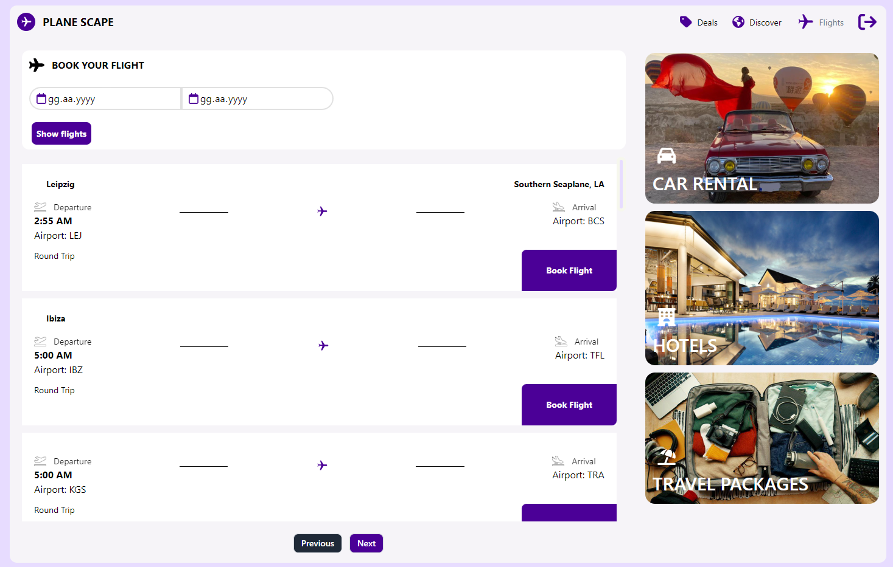
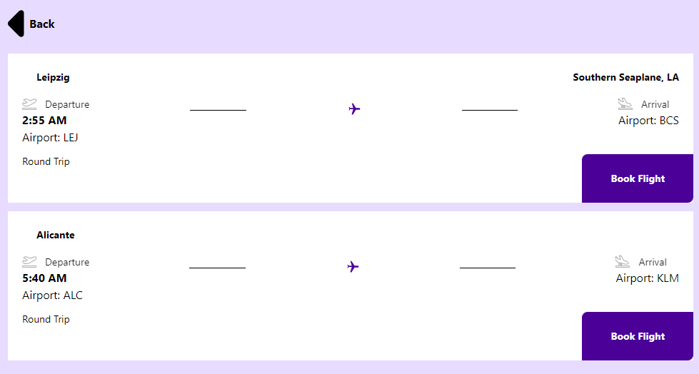

# React Flight Management

This project is a React application for viewing and managing flight information. Users can log in, add flight details, and view their saved flights.

## Setup

### Requirements

- Node.js
- npm or yarn

### Installation Steps

1. **Clone the Repository**

   ```bash
   git clone https://github.com/mahmutcant/BookFlightUI
   cd BookFlightUI

2. **Install Dependencies**
    ```bash
        npm install
        # or
        yarn install

3. **Configure Environment Variables**
    ```bash
        VITE_SCHIPHOL_API_BASE_URL=https://api.schiphol.nl
        VITE_SCHIPHOL_API_APP_ID=app_id
        VITE_SCHIPHOL_API_APP_KEY=app_key
        VITE_USER_BACKEND_BASE_URL=http://localhost:5000
4. **Start the Application**
    ```bash
    npm start
    # or
    yarn start




